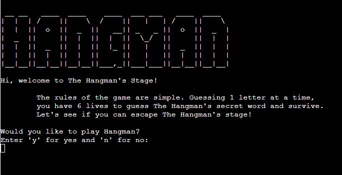
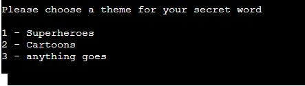

# **The Hangman's Stage!**
## **Aim of the site**

The aim of the site is to allow users to play a single player python command line version of the Hangman game. There are 3 categories of words for players to choose from on each run through of the game. The player then has 6 guesses to correctly guess the secret word or fail the game.

## **Game Features**
### **Title Screen**

The title screen welcomes players to the site, explains the rules and asks the player to input "y" to play the game and "n" to exit the game.

### **Theme Choices**

Once the user has input "y" to play the game, they're presented with a list of theme's to choose for the secret word.

### **Game Play**

**The Secret Word**

The secret word is presented to user with a series of underscores which match the length of the secret word. Underscores are replaced with correct letter guesses.

As the player guesses letters, the letter is appended to a list of used characters which is then printed so the player is aware of letters they have already guessed. 
**Invalid Selections**

If the player inputs an invalid selection, such as too many letters, numbers or a letter than have already entered, they're presented with an error message.

**Hanging Stages**

The player is given 6 lives at the start of the game. Each incorrect answer is visally represented with a hangman graphic. Each of the 6 lives is associated with a body part: head, torso, left arm, right arm, left leg and right leg.

**Correctly Or Incorrectly Guessing The Word**

If the player manages to correctly guess the word within their 6 lives, they're presented with a congratulatory message and asked if they would like to continue playing. On the other hand, if the player fails to guess the word, they're presented with a fail message and again asked if they would like to continue playing.

## **Possible Future Features**

* A timer feature, so the player is not only playing against the 6 lives but also timing out will result in a failure.

## **Technologies Used**

This project has been created using [Python](https://www.python.org/). Any other technologies present such as javascript are part of the Code Institute template used to create this project.
I have run the python code through the [PEP8 Validator](http://pep8online.com/) which resulted in no errors.

## **Testing**

The game has been deployed using Heroku and runs in a command line Python Terminal. I've tested the site using Chrome, Firefox and Edge browsers on PC and also on mobile using Chrome. I tried to cause the code to crash at various points using incorrect inputs to try and make the code break it's loop. As there are numerous inputs for the user, I tested these all during development. Below is documentation of my testing.

### **User Inputs**
**Select Theme/Continue Playing**

**Expected Outcomes:** Various user inputs are requested whilst playing the game. These are all expected to progress to the next stage of the code with correct inputs or return an error message requesting the correct input.

**Test:** These were tested with correct inputs to make sure the code would progress. Incorrect inputs, such as numbers, upper and lowercase letters, special characters, blank spaces were also tested.

**Verdict:** In the above user inputs, all correct inputs progressed the code correctly and incorrect inputs displayed a message prompting the user for the right input. Two user inputs did not originally run as intended so I have listed their individual testing.

#### **Starting the Game**

**Expected Outcome:** The player is given 2 options on the welcome screen, Y to play the game and N to exit. Any other inputs are expected to return an error message and request the correct input again.

**Test:** To test this I tried to input characters other than Y or N, such as lowercase letters, numbers, special characters and more than 1 character.

**Result:** Correct inputs would either start the game or exit as intended. The .upper() function was used on the input field incase of lowercase input. However, if the user input an invalid option, the game would not start and the code broke it's loop.

**Verdict:** This test failed at this stage as the game would code would break it's loop at this stage.

**Solution:** To solve this problem, I added a **'while True'** statement to the welcome_screen function.

**Test 2:** Again I tested incorrect input as in the initial testing.

**Verdict 2:** With the **'while True'** statement, any invalid input printed the appropriate error message and requested the correct input.

### **Selecting Lives**

**Expected Outcome:**  The user is given the option of the amount of lives they wish to play with. Most players of the game use 6 lives, but I have also given the option of choosing 3 to make the game more challenging.

**Test:** Inputting 3 or 6 to see if the code will progress and inputting invalid options.

**Verdict:** If the user inputs 3 or 6 the game progresses as intended, however, any invalid inputs printed the intended error but then exited the code causing the game to stop.

**Solution:** To solve this, I added a 'while lives_left == 0' loop to continue to requesting the correct input upon an invalid input.

**Test 2:** As above testing, focusing on incorrect inputs as correct inputs caused no errors.

**Verdict 2:** With the while loop added, the user is prompted for correct inputs until it is entered.

### **Player Guesses**

**Expected Outcome:**  Once the game is running, the user is presented with the secret word to guess. Correct guesses reveal letters in the secret word and incorrect guesses result in a life lost and a graphic from the hanging stages relevant to the lives left. The .upper function is used on input function for players guesses and the secret word is also displayed in uppercase if guesses are correct. If the player has guessed a letter already, they're provided with a message stating this and requesting another letter. Invalid characters or guesses of more than 1 letter at a time also result in a message requesting correct inputs.

**Test:** As with all the input tests, correct and incorrect inputs were tested.

**Result:** All inputs resulted in planned outcomes. Correct guesses reveal letters in the sercret word, incorrect guesses resulted in lives lost and the hangman graphic being displayed. Guesses more than 1 character in length and special characters returned messages prompting users for correct inputs.

**Verdict:** This stage of the game runs smoothly as intended until the players either guesses or fails to guess the secret word and then progresses on to the win or fail stage.

### **Win or lose**

**Expected Outcome:**  Once the player has successfuly or unsuccesfuly guessed the secret word, a message is displayed and they're invited to play again or exit the game.

**Test:** Successful and unsuccessful atttempts at guessing the secret word were made.

**Result:** Win or fail messages are displayed upon the player guessing or failing to guess the secret word.

**Verdict:** The messages are displayed as coded, although there was a bug caused by the ASCII are causing them to display incorrectly. This is documented below in the Bugs section.

## **Bugs**

1.  **Intended Outcome** - ASCII Art to be used for graphics
    * ***Issue Found***
        * The backslashes present in the ASCII Art used for my title, win and fail graphics would cause these graphics to be printed out incorrectly. These would appear blue in the code
    * ***Solution***
        * To resolve this, I had to use double backslashes wherever a blue backslash was present.