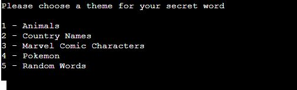
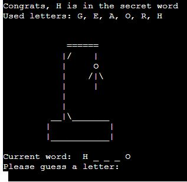
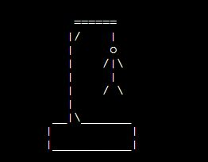
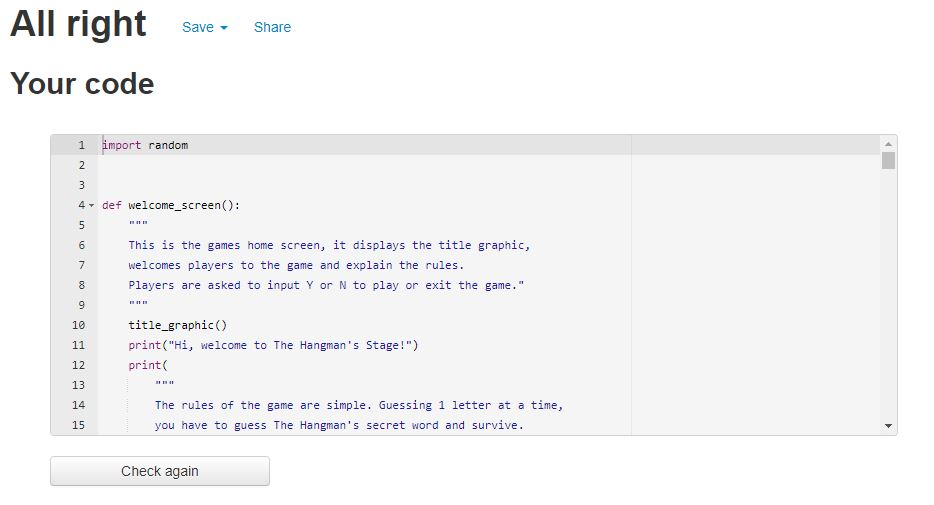

# **The Hangman's Stage!**
## **Aim of the site**

The aim of the site is to allow users to play a single player python command line version of the Hangman game. There are 5 categories of words for players to choose from on each run through of the game. The player can then select if they have three or six lives to correctly guess the secret word or fail the game.

I've tried to aim for a broad target audience by including five categories. Players can stick to a catergory they feel comfortable with or maybe step out of their comfort zone and choose something different.

The deployed site can be found [here](https://the-hangmans-stage.herokuapp.com/)

## **Game Features**
### **Title Screen**

The title screen welcomes players to the site, explains the rules and asks the player to enter "Y" to play the game and "N" to exit the game.

### **Theme Choices**

Once the user has input "Y" to play the game, they're presented with a list of five themes to choose for the secret word.

### **Game Play**

**The Secret Word**

The secret word is presented to user with a series of underscores which match the length of the secret word. Underscores are replaced with correct letter guesses.

As the player guesses letters, the letter is appended to a list of used characters which is then printed so the player is aware of letters they have already guessed. 

**Invalid Selections**

If the player inputs an invalid selection, such as too many letters, numbers or a letter than have already entered, they're presented with an error message.

**Hanging Stages**

Each incorrect answer is visually represented with a hangman graphic. Each of the lives is associated with a body part: head, torso, left arm, right arm, left leg and right leg. If a player chooses to play with three lives then the first hanging image shown is relevant to three lives left.

**Correctly Or Incorrectly Guessing The Word**

If the player manages to correctly guess the word within their lives, they're presented with a congratulatory message and asked if they would like to continue playing. On the other hand, if the player fails to guess the word, they're presented with a fail message and again asked if they would like to continue playing. In both instances, players are also given the option to exit the game.

**Continue Playing Or Exit**

Once the game is over and the player has won or lost they can either choose to continue playing, at which point it will ask them to select another theme and amount of lives, or simply exit the game.

## **Possible Future Features**

* A timer feature, so the player will fail the game either if they lose their lives OR the timer runs out.
* Adding a nine lives option to make the game easier.
* Adding even more categories.
* Adding a feature so the player is not asked to select a new theme and amount of lives after every word if they continue playing.

## **Technologies Used**

This project has been created using [Python](https://www.python.org/). Any other technologies present, such as javascript, are part of the Code Institute template used to create this project.

## **Testing**

The game has been deployed using Heroku and runs in a command line Python Terminal. I've tested the site using Chrome, Firefox and Edge browsers on PC and also on mobile using Chrome. I tried to cause the code to crash at various points using incorrect inputs to try and make the code break it's loop. As there are numerous inputs for the player, I tested these all during development. Below is documentation of my testing.

### **User Inputs**
**Select Theme/Continue Playing**

**Expected Outcomes:** Various user inputs are requested whilst playing the game. These are all expected to progress to the next stage of the code with correct inputs or return an error message requesting the correct input.

**Test:** These were tested with correct inputs to make sure the code would progress. Incorrect inputs, such as numbers, upper and lowercase letters, special characters and blank spaces were also tested.

**Result:** In the above user inputs, all correct inputs progressed the code correctly and incorrect inputs displayed a message prompting the user for the right input. Two user inputs did not originally run as intended so I have listed their individual testing.

**Verdict:** Code functioned as intended and did not break at any stage.

#### **Starting the Game**

**Expected Outcome:** The player is given two options on the welcome screen, Y to play the game or N to exit. Any other inputs are expected to return an error message and request the correct input again.

**Test:** To test this I tried to input characters other than Y or N, such as lowercase letters, numbers, special characters and more than one character.

**Result:** Correct inputs would either start the game or exit as intended. The .upper() function was used on the input field incase of lowercase input. However, if the user input an invalid option, the game would not start and the code broke its loop.

**Verdict:** This test failed at this stage as the game code would break it's loop at this stage.

**Solution:** To solve this problem, I added a **'while True'** statement to the welcome_screen function.

**Test 2:** Again I tested incorrect input as in the initial testing.

**Result 2:** With the **'while True'** statement, any invalid input printed the appropriate error message and requested the correct input.

**Verdict 2:** This function now works, and the code loops through the game correctly.

### **Selecting Lives**

**Expected Outcome:**  The user is given the option of the amount of lives they wish to play with. Most players of the game use six lives, but I have also given the option of choosing three to make the game more challenging.

**Test:** Inputting three or six to see if the code will progress and inputting invalid options.

**Result:** If the user inputs three or six the game progresses as intended, however, any invalid inputs printed the intended error but then exited the code causing the game to stop.

**Verdict:** This test has failed as incorrect inputs broke out of the code.

**Solution:** To solve this, I added a 'while lives_left == 0' loop to continue to request the correct input upon an invalid input.

**Test 2:** As above testing, focusing on incorrect inputs as correct inputs caused no errors.

**Result 2:** With the while loop added, the user is prompted for correct inputs until it is entered.

**Verdict 2:** The code now functions as intended and the user can play the game and start guessing the secret word.

### **Random Words**

**Expected Outcome:** A random word to be selected from the theme text files to be used as the secret word.

**Test:** Selecting a theme from the theme list.

**Result:** Random words were selected from the text files as intended, however as these lists were taken from various sites on the internet (see credits),  some words containted special characters such as commas or blanks spaces. As my input check method uses .isaplha(), this meant users would not be able to guess these words.

**Verdict:** Unguessable answers due to special characters would cause a negative user experience. These words would need to be filtered out.

**Test 2:** I added 'while' loops with 'or' to the random word selection. When a random word was selected, the 'while' loop would look for words containing commas, or blank spaces, or parentheses etc. and then run the random word selection again. To make sure this would work, I reduced the words in the files to a handful, with only 1 word that would pass the test.

**Result 2:** Only one word answers with no special characters or blanks spaces were selected from the theme files.

**Verdict 2:** This function now runs as intended with only relevant words being selected as the random word.

### **Player Guesses**

**Expected Outcome:**  Once the game is running, the user is presented with the secret word to guess. Correct guesses are to reveal letters in the secret word and incorrect guesses are to result in a life lost and a graphic from the hanging stages relevant to the lives left. The .upper() function is used on input of players guesses and the secret word is also displayed in uppercase if guesses are correct. If the player has guessed a letter already, they're provided with a message stating this and requesting another letter. Invalid characters or guesses of more than one letter at a time also result in a message requesting correct inputs.

**Test:** As with all the input tests, correct and incorrect inputs were tested.

**Result:** All inputs resulted in planned outcomes. Correct guesses reveal letters in the sercret word, incorrect guesses resulted in lives lost and the hangman graphic being displayed. Guesses more than one character in length and special characters returned messages prompting users for correct inputs.

**Verdict:** This stage of the game runs smoothly as intended until the players either guesses or fails to guess the secret word and then progresses on to the win or fail stage.

### **Win or lose**

**Expected Outcome:**  Once the player has successfuly or unsuccesfuly guessed the secret word, a message is displayed and they're invited to play again or exit the game.

**Test:** Successful and unsuccessful atttempts at guessing the secret word were made.

**Result:** Win or fail messages are displayed upon the player guessing or failing to guess the secret word.

**Verdict:** The win or lose messages are displayed, however there was a bug caused by the ASCII were causing them to display incorrectly. This is documented below in the Bugs section.

## **Validator testing**

I have run the python code through the [PEP8 Validator](http://pep8online.com/) which resulted in no errors.

## **Bugs**

1.  **Intended Outcome** - ASCII Art to be used for graphics
    * ***Issue Found***
        * The backslashes present in the ASCII Art used for my title, win and fail graphics would cause these graphics to be printed out incorrectly. These would appear blue in the code
    * ***Solution***
        * To resolve this, I had to use double backslashes wherever a blue backslash was present.

## **Deployment**

The page was deployed using Heroku. The procedure to do this was:
1. Use [GitHub](https://github.com) to build project.
2. Push built project code to GitHub.
3. Navigate to [Heroku](https://heroku.com)
4. Login or signup to the site.
5. Select create a new app, select a unique name and region.
6. Click settings, then reveal config vars.
7. Add PORT to the KEY field and 8000 to the VALUE field.
8. Select Buildpack, select Python and save.
9. Select Buildpacks again and select Nodejs and save again.
10. Ensure order of Buildpacks is Python then Nodejs.
11. Navigate to the deploy tab, choose GitHub as deployment method and connect to you GitHub account.
12. Enter your repository and connect.
13. Select either automatic deploys which automatically deploys whenever you push to GitHub, or manual deploys to deploy manually.
14. Once deployment is finished, click view to be taken to the deployed app.
15. [Live site here](https://the-hangmans-stage.herokuapp.com/)

## **Credits**

[AZ Animals](https://a-z-animals.com/animals/) for the list of animals.

[Kalinchernev](https://gist.github.com/kalinchernev/486393efcca01623b18d) on [GitHub Gist](https://gist.github.com/) for plain text list of countries.

[Marvel](https://www.marvel.com/comics/characters) for the list of Marvel Comic characters.

[Phawks](https://www.reddit.com/r/pokemon/comments/1qrnw8/i_made_a_few_plain_text_printer_friendly_pokemon/) user on [Reddit](reddit.com) for google docs spreadsheet of Pokemon.

[Random Lists](https://www.randomlists.com) for a random list of words.

[Kylie Ying](https://www.youtube.com/watch?v=cJJTnI22IF8&t=513s) tutorial on youtube. The code used for the secert word to be displayed as underscores (___) then revlealing a correct letter was taken from this tutorial. This code is present on line 139 of the run.py file.

[Stack Overflow](https://stackoverflow.com/questions/32773275/pulling-a-random-word-string-from-a-line-in-a-text-file-in-python) for the process of selecting a random word from a text file.

Richard Wells, my course mentor for again providing postive reassurance when imposter syndrome sets in.