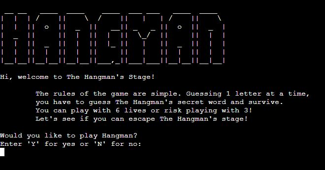

# **The Hangman's Stage!**
## **Aim of the site**

The aim of the site is to allow users to play a single player python command line version of the Hangman game. There are 3 categories of words for players to choose from on each run through of the game. The player then has 6 guesses to correctly guess the secret word or fail the game.

## **Game Features**
### **Title Screen**

The title screen welcomes players to the site, explains the rules and asks the player to input "y" to play the game and "n" to exit the game.

### **Theme Choices**

Once the user has input "y" to play the game, they're presented with a list of theme's to choose for the secret word.

### **Game Play**

**The Secret Word**

The secret word is presented to user with a series of underscores which match the length of the secret word. Underscores are replaced with correct letter guesses.

As the player guesses letters, the letter is appended to a list of used characters which is then printed so the player is aware of letters they have already guessed. 
**Invalid Selections**

If the player inputs an invalid selection, such as too many letters, numbers or a letter than have already entered, they're presented with an error message.

**Hanging Stages**

The player is given 6 lives at the start of the game. Each incorrect answer is visally represented with a hangman graphic. Each of the 6 lives is associated with a body part: head, torso, left arm, right arm, left leg and right leg.

**Correctly Or Incorrectly Guessing The Word**

If the player manages to correctly guess the word within their 6 lives, they're presented with a congratulatory message and asked if they would like to continue playing. On the other hand, if the player fails to guess the word, they're presented with a fail message and again asked if they would like to continue playing.